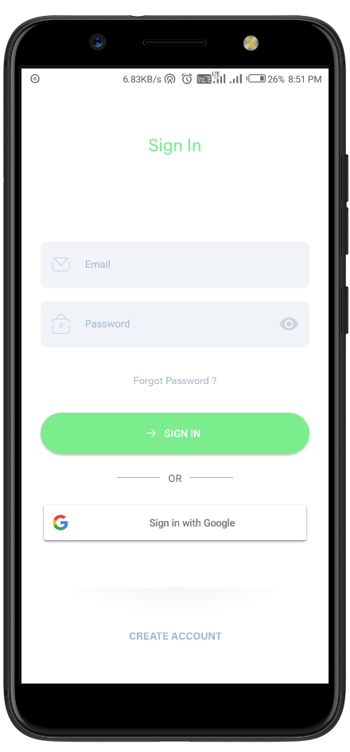
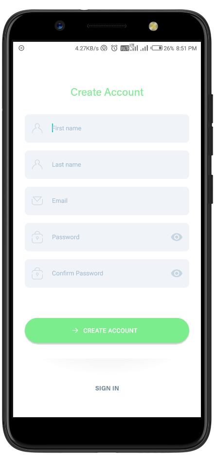
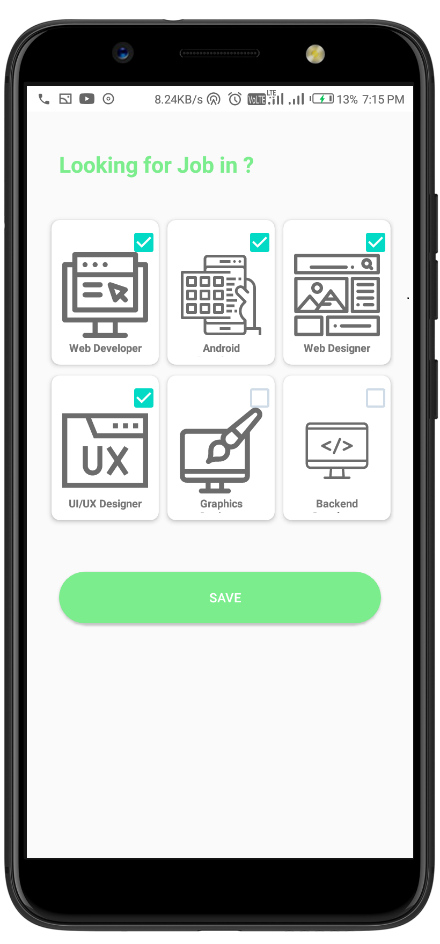
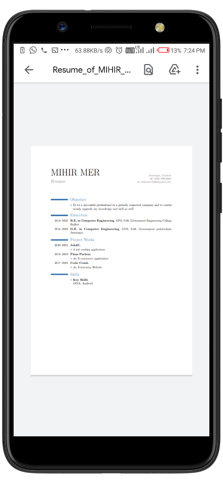
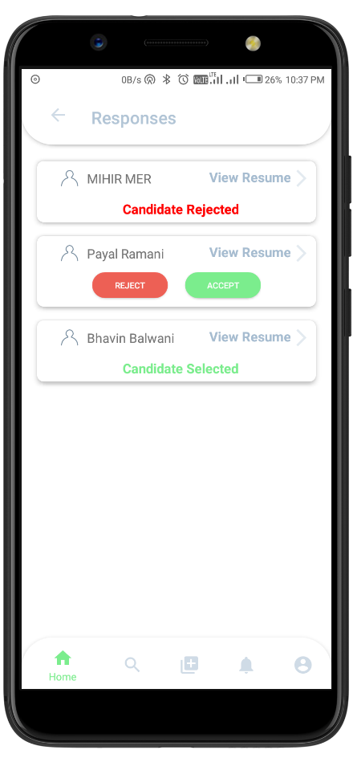
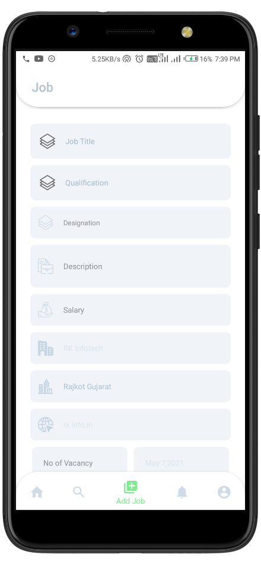
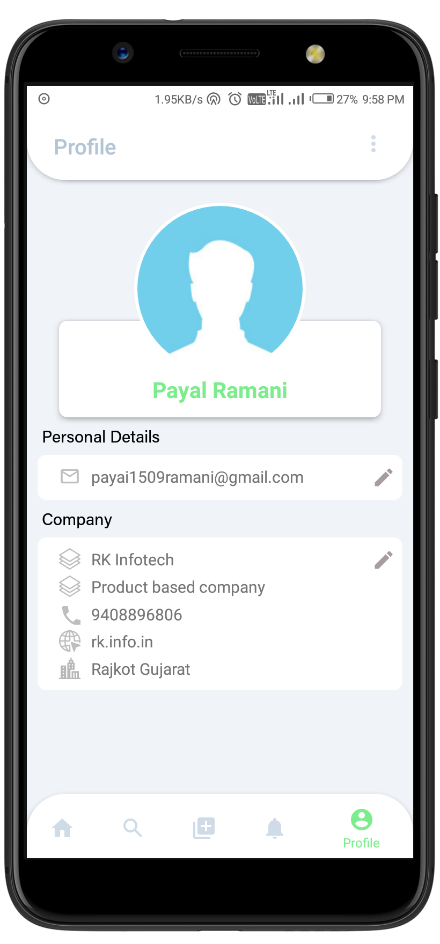

# **Job4U - Walk in world** 

Android application, which serves job seekers to find available job vacancies and employers to identify eligible job seekers with the prospect of selecting the most qualified candidates.

## Features 🔥

- Effective way of job seeking.
- Quality Resume Building.
- Find vacancy suitable to skills.
- Get relevant news delivered to you.
- Easily submit your resume for any job.
- Reduce the gap of HR-Seeker.
- Preview the best candidates for the job to hire.

## 📸 Screenshots

### Job Seeker

|   |   |   |
|---|---|---|
||||
||||
||||
||||
||| |

### Recruiter
|   |   |   |
|---|---|---|
|||
||

## Technology Used 🛠

### Client Side

### Server side

 
 
 

